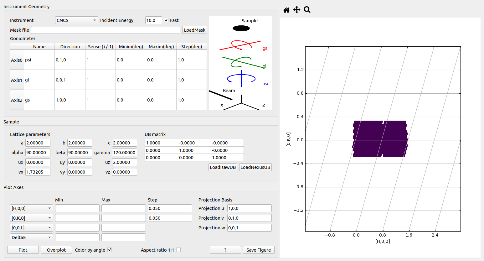

.. _testpage2:

==========================
Same Tests for python code
==========================

.. contents::
  :local:

Test 1
######

This is just a figure, produced at buildtime

.. plot::
   :include-source:
   
   # This figure is a test
   import numpy as np
   import matplotlib.pyplot as plt
   
   x = np.arange(11)
   y = x**2
   
   fig, ax = plt.subplots()
   ax.plot(x, y)
   #fig.show()
   
Test 2
######

This is just a test for rendering MathJax

.. math::

  y = ax^2 +\beta+\AA^{-1}

Test 3
######

.. testcode::

   1+1         # this will give no output!
   print(2+2)  # this will give output

.. testoutput::

   4
   
Test 4
######
Test with setup

.. testsetup:: test4

   import sys

.. testcode:: test4

   print('/usr/lib/python3/dist-packages' in sys.path)

.. testoutput:: test4

   True

Test 5
######
Test GUI plot

   
Done image

.. plot_gui:: dgs_picture generate_picture dgs_planner_fig2.png
   :height: 300
   :width: 500
   :align: center
   :function_parameters: {"Instrument":"HYSPEC", "Ei":30, "S2":30, "psi_min":0, "psi_max":90, "psi_step":15, "a":2, "b":2, "u":"1,0,0", "v":"0,1,0"}
   
   caption2

Done
